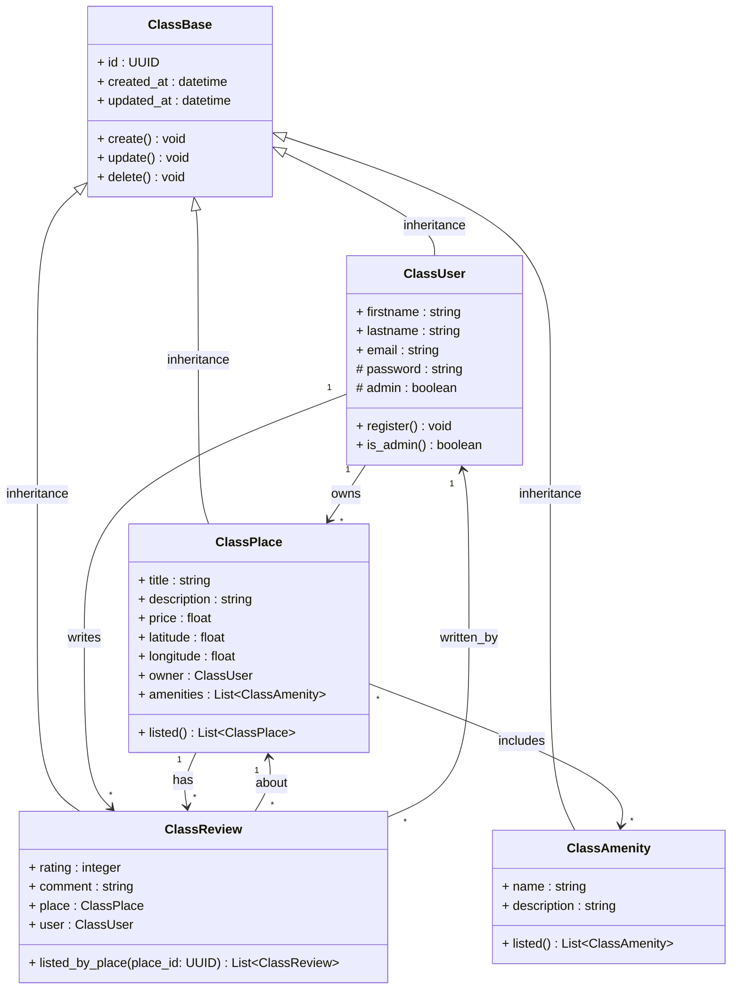
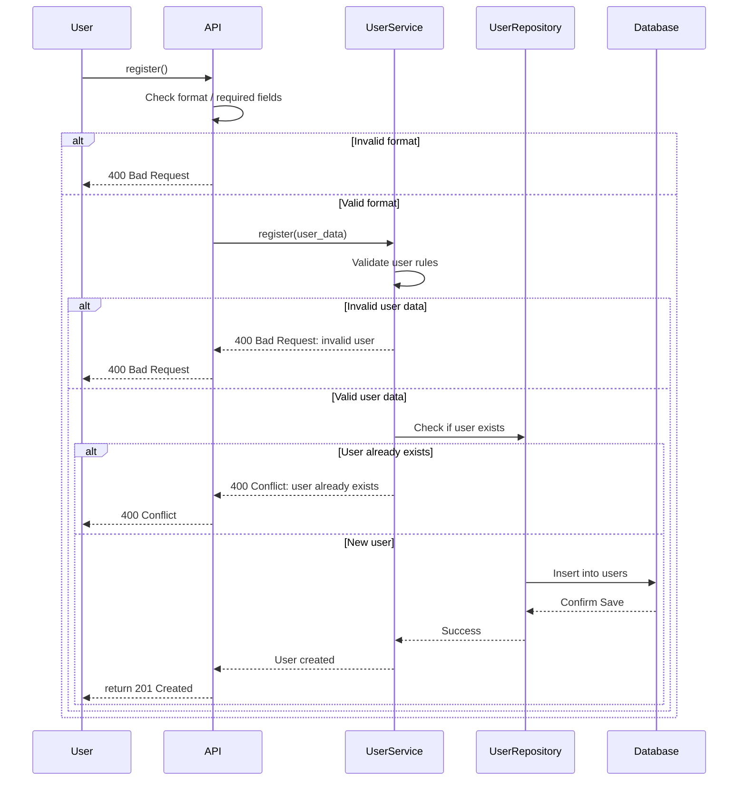
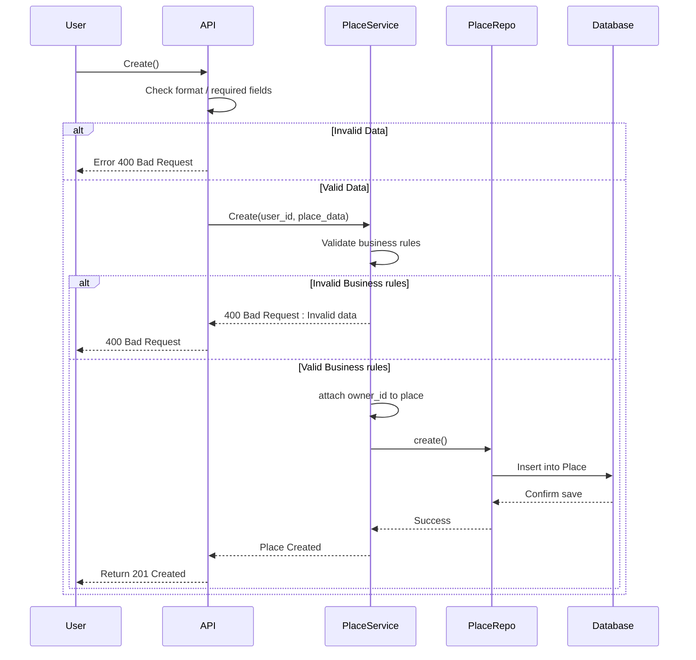
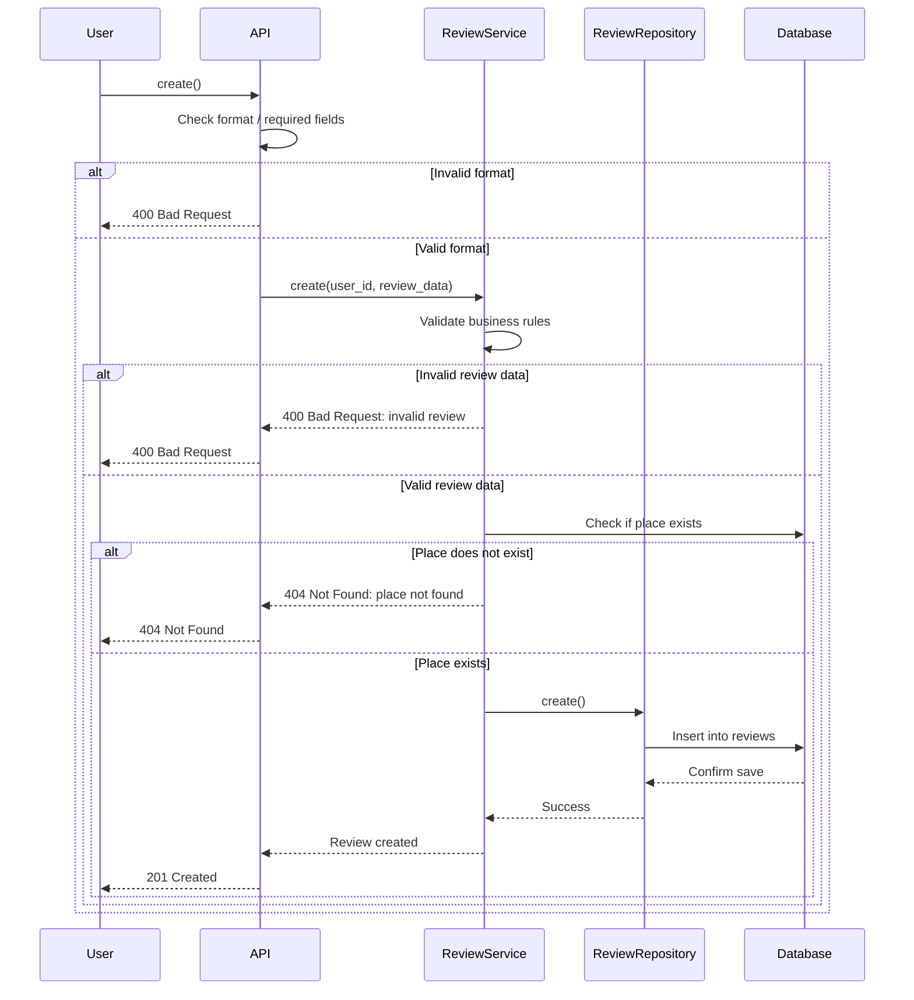
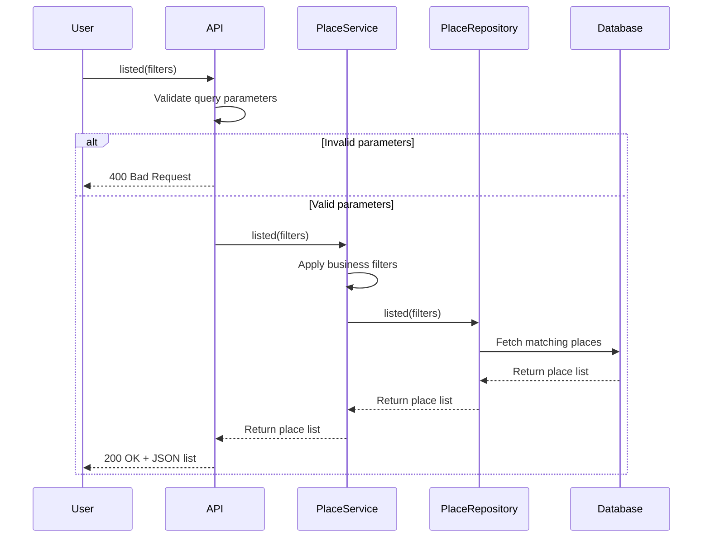

# 🏗️ HBnB – Technical Architecture Documentation

---

## 📘 Introduction

The **HBnB** project is a simplified re-implementation of the AirBnB platform. It involves user account management, place listing creation, review submission, and search/filter functionalities. This document presents the technical design blueprint of the application and is intended as a reference throughout the development process.

It compiles:
- A high-level architectural overview of the system
- A detailed class diagram for the business logic layer
- Four sequence diagrams representing key API interactions

---

## 🧱 High-Level Architecture

### 🔹 Overview

The HBnB system is built using a **3-layer architecture**:
- **Presentation Layer (API)**: Handles incoming client requests
- **Business Logic Layer (Service)**: Processes application logic and enforces rules
- **Persistence Layer (Repository)**: Manages interaction with the database

The architecture uses the **Facade Pattern** to simplify the connection between the API and business logic.

### 🔸 Diagram

- Services like `UserService`, `PlaceService`, and `ReviewService` act as facades to the business logic.
- Repositories isolate data access from the business layer.

### 🔸 Notes

- Each layer is decoupled, allowing for isolated testing and maintenance.
- API communicates only with Services, never directly with Repositories.

---

## 📐 Business Logic Layer – Class Diagram

### 🔹 Diagram

### 🔸 Overview

The class diagram defines the core entities:
- `User`: has a `register()` method and owns Places and Reviews
- `Place`: linked to a `User` (owner), has a `listed()` method, includes Amenities
- `Review`: linked to both a `User` and `Place`, includes `rating`, `comment`
- `Amenity`: features associated with a Place
- `Base`: abstract class with shared attributes/methods like `create()`, `update()`

### 🔸 Relationships

- `User 1 → * Place`
- `Place 1 → * Review`
- `Place * ↔ * Amenity`
- `Review * → 1 Place`
- `Review * → 1 User`

---

## 🔁 API Interaction Flow – Sequence Diagrams

### 🧍 User Registration

- The user registers through `API → UserService → UserRepository`
- Validations include format checks, rule enforcement, and email uniqueness
- Errors: `400 Bad Request`, `409 Conflict`
- Success: `201 Created`

### 🏠 Place Creation

- The user creates a listing with `user_id` and `place_data`
- Business rules are applied (e.g., price must be positive)
- `PlaceRepository` handles persistence
- Success: `201 Created`, Error: `400`

### 📝 Review Submission

- The user submits a review for an existing `Place`
- Validation includes rating bounds, place existence
- May return: `400`, `404`, or `201 Created`

### 🏡 Fetching a List of Places

- The user queries places using filters
- Service applies optional business filters
- Repository returns matching results
- Response: `200 OK + JSON`

---

## ✅ Summary

This document compiles the complete technical foundation for HBnB, structured across architecture, class modeling, and runtime interactions. It ensures a clean, modular, and testable base for implementing the full functionality.
