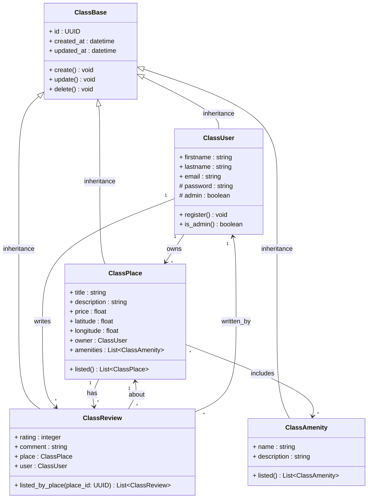

# 🧾 Detailed Class Diagram for the Business Logic Layer

## 🧭 Overview of Functionality

This class diagram models the business logic layer of the **HBnB** application, focusing on the main entities: **User**, **Place**, **Review**, and **Amenity**.

The goal is to represent their **attributes**, **methods**, and **relationships**, according to the business rules.

---

## 🧱 Shared Structure

All entities inherit from `ClassBase`, which contains common attributes for all business objects:

- `id: UUID`
- `created_at: datetime`
- `updated_at: datetime`
- Basic methods: `create()`, `update()`, `delete()`

---

## 🧍 Entity: ClassUser

`ClassUser` represents a user of the HBnB platform. They can be a regular user or an administrator capable of creating places and posting reviews.

### Attributes:
- `firstname`, `lastname`, `email`: personal information
- `password`, `admin`: authentication and role information

### Methods:
- `register()`: Allows a user to register in the system.
- `is_admin()`: Checks whether the user is an administrator.

### Relationships:
- Owns multiple `ClassPlace`
- Writes multiple `ClassReview`

---

## 🏠 Entity: ClassPlace

`ClassPlace` represents a property made available by a user. Each place is geolocated and can be enriched with amenities.

### Attributes:
- `title`, `description`, `price`, `latitude`, `longitude`
- `owner: ClassUser`
- `amenities: List<ClassAmenity>`

### Methods:
- `listed()`: Returns all available places.

### Relationships:
- Owned by a user
- Can have multiple `Review`
- Linked to multiple `Amenity`

---

## 📝 Entity: ClassReview

`ClassReview` represents a comment and rating left by a user after visiting a place.

### Attributes:
- `rating`, `comment`, `place`, `user`

### Methods:
- `listed_by_place(place_id)`: Returns all reviews associated with a specific place

### Relationships:
- Written by a user
- Refers to a place

---

## 📺 Entity: ClassAmenity

`ClassAmenity` represents a service or equipment that can be associated with a place (e.g., Wi-Fi, parking, pool...).

### Attributes:
- `name`, `description`

### Methods:
- `listed()`: Returns all available amenities

### Relationships:
- Used in multiple places

---

## 🔗 Relationships and Cardinalities

> The table below presents the main associations between entities, along with inheritance relationships with the generic class `ClassBase`.

| Relationship        | Type        | Cardinality |
|---------------------|-------------|-------------|
| User → Place        | Association | 1 → *       |
| User → Review       | Association | 1 → *       |
| Place → Review      | Association | 1 → *       |
| Place ↔ Amenity     | Association | * ↔ *       |
| Review → User       | Association | * → 1       |
| Review → Place      | Association | * → 1       |
| Base → Place        | Inheritance |             |
| Base → Review       | Inheritance |             |
| Base → Amenity      | Inheritance |             |
| Base → User         | Inheritance |             |

---

## 🧠 Design Choices

- The `listed()` methods are placed in each entity to serve as logical entry points for retrieving data.
- Relationships are modeled using UML arrows (`-->`) with cardinalities to clearly express dependencies.
- Data types are explicitly stated to prepare for Python code implementation.

---
