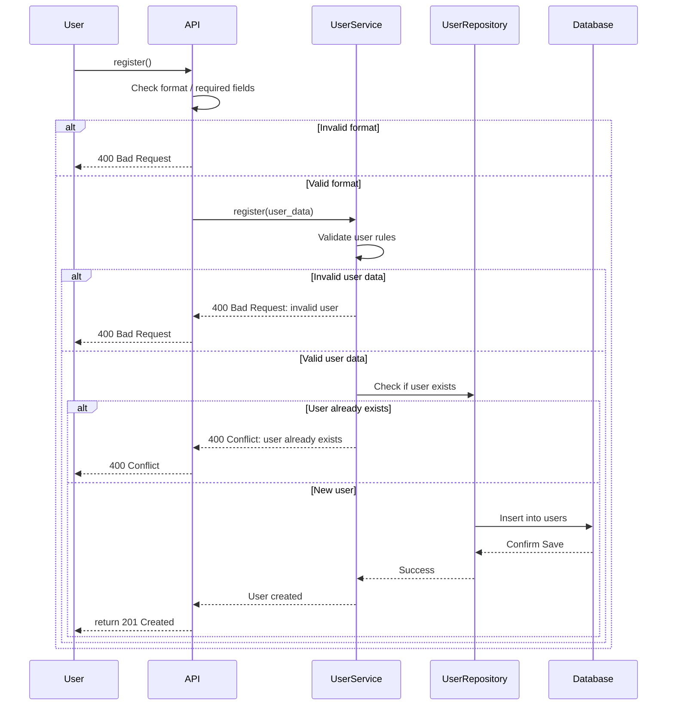
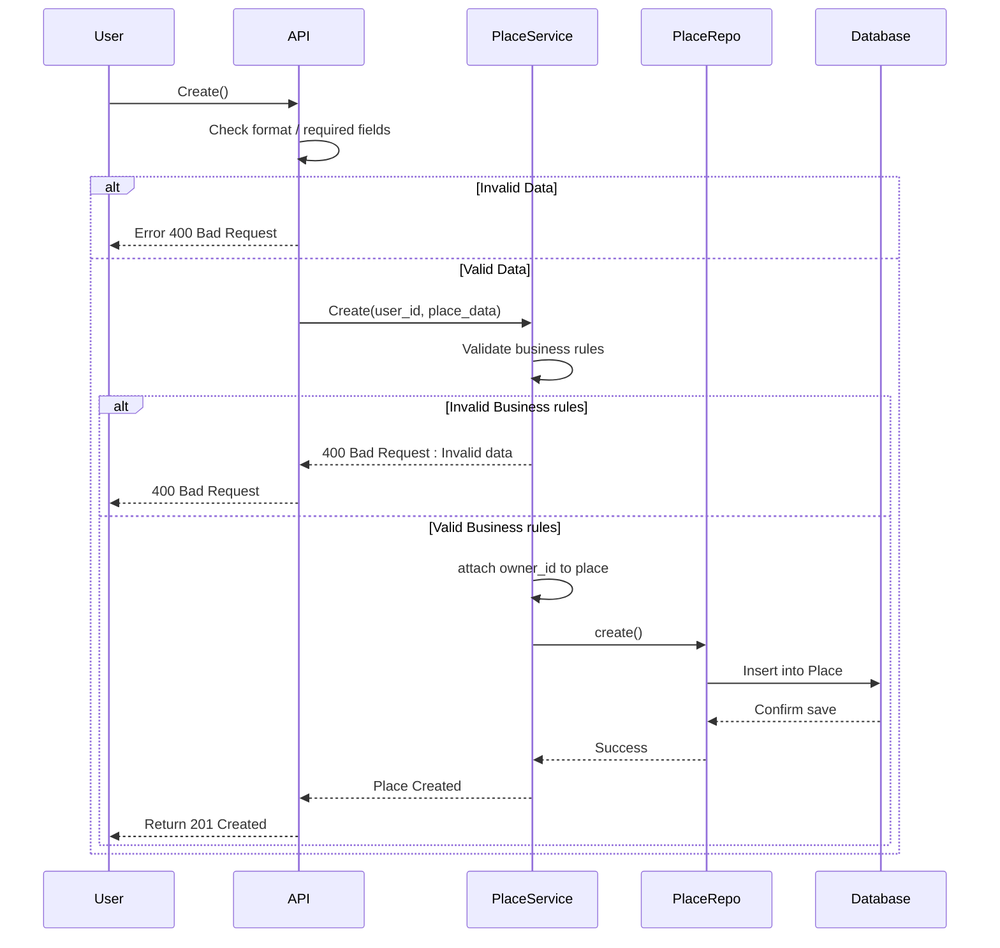
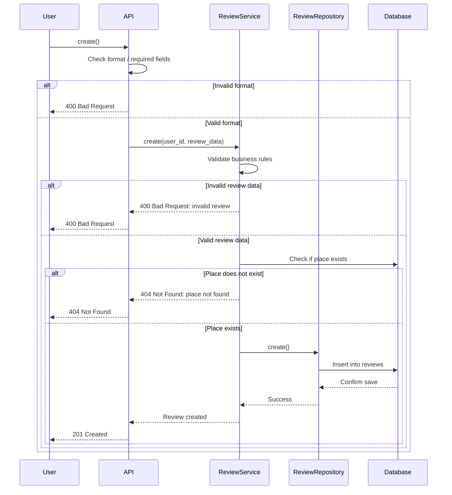
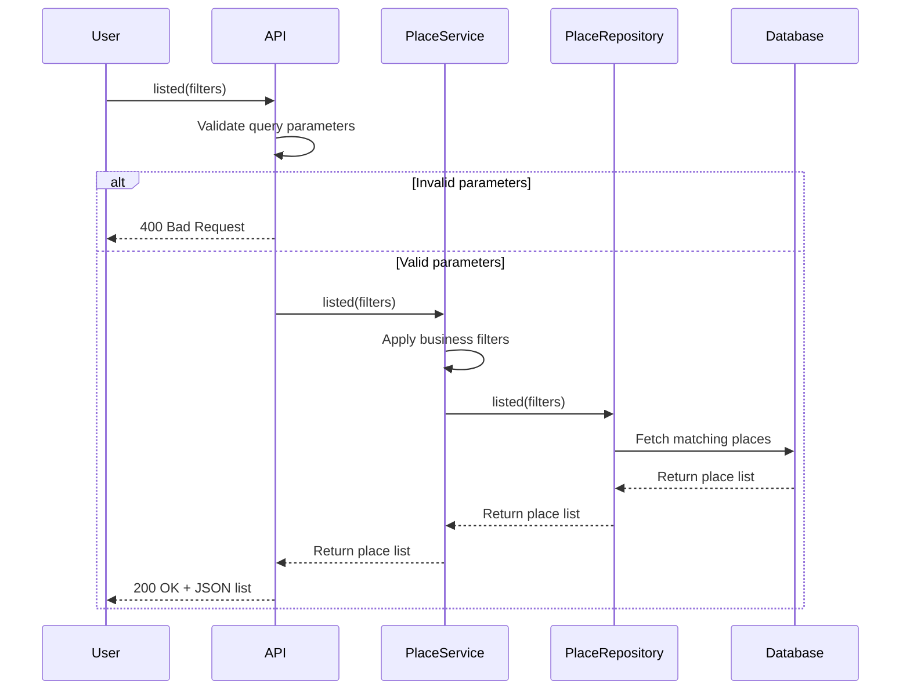

# 📲 Sequence Diagrams for API Calls

---

## 🧍 Sequence Diagram: User Registration

### 🔹 Description:
The user submits a request to register an account. The system validates the input, checks for email uniqueness, and saves the user if all is valid.

### 🔸 Flow of Interactions:
- **API**: Checks data structure and required fields.
- **UserService**: Applies business rules (valid data, uniqueness).
- **UserRepository**: Checks existence and saves the user.
- **Database**: Persists the data.
- Returns `201 Created` on success, or `400`/`409` on error.

---

## 🏠 Sequence Diagram: Place Creation

### 🔹 Description:
An authenticated user creates a new listing. The system validates the data, assigns ownership, and stores it.

### 🔸 Flow of Interactions:
- **API**: Validates required fields.
- **PlaceService**: Applies business rules (e.g. positive price).
- **PlaceService** attaches the `owner_id` to the place.
- **PlaceRepository**: Saves the entity.
- **Database**: Confirms persistence.
- Returns `201 Created` or `400 Bad Request`.

---

## 📝 Sequence Diagram: Review Submission

### 🔹 Description:
The user submits a review for a place. The system ensures the data is valid and the place exists before saving the review.

### 🔸 Flow of Interactions:
- **API**: Checks required data (`rating`, `comment`, `place_id`, etc.).
- **ReviewService**: Applies business validation.
- **ReviewService** checks if the `Place` exists.
- **ReviewRepository**: Saves the review.
- **Database**: Confirms persistence.
- Returns `201 Created`, or `400`/`404` if invalid or not found.

---

## 🏡 Sequence Diagram: Fetching a List of Places

### 🔹 Description:
The user requests a filtered list of available places.

### 🔸 Flow of Interactions:
- **API**: Validates input parameters.
- **PlaceService**: Applies filtering logic (if any).
- **PlaceRepository**: Queries the database.
- **Database**: Returns matching places.
- Response sent to user as a `200 OK` with a JSON payload.

---
