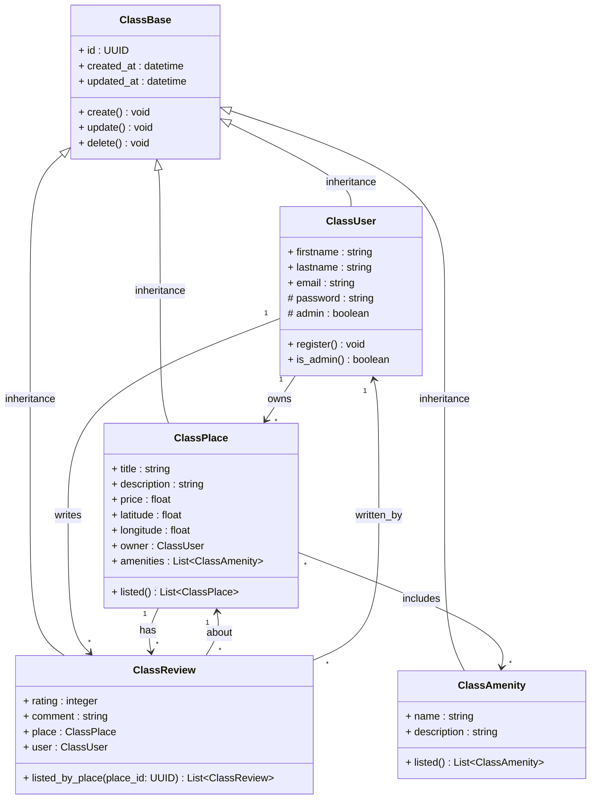
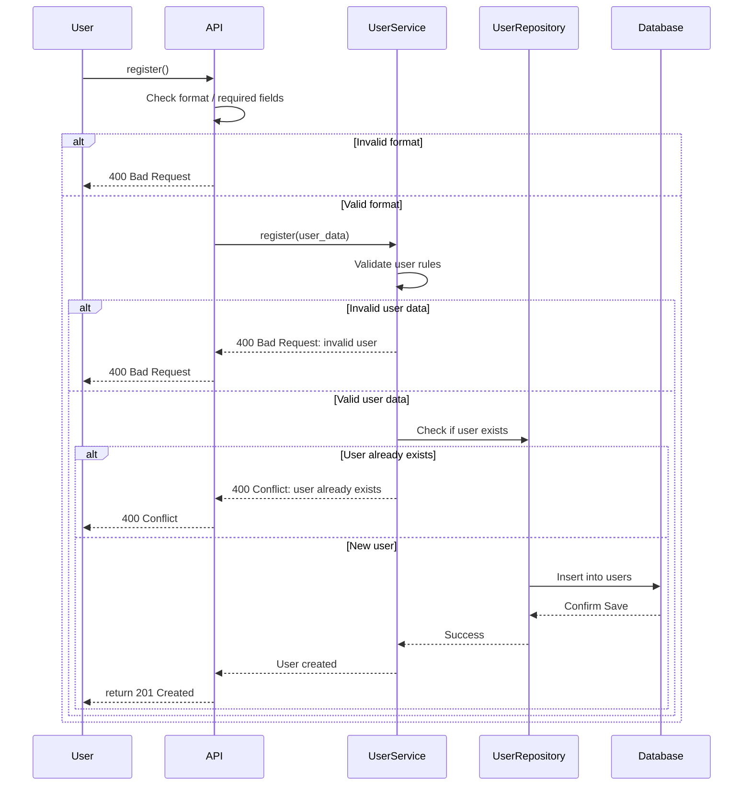
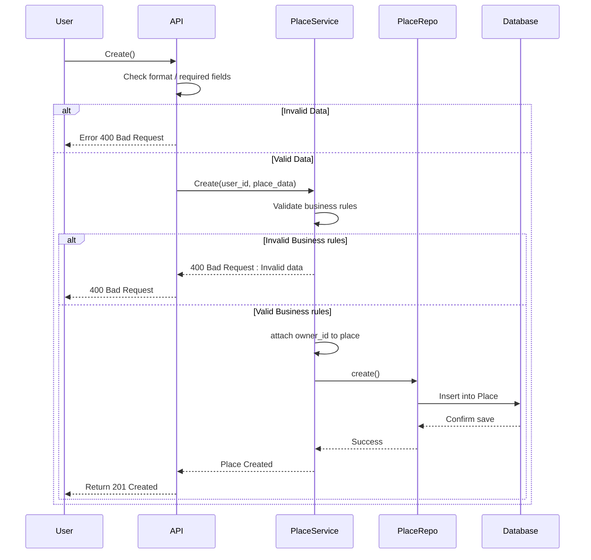
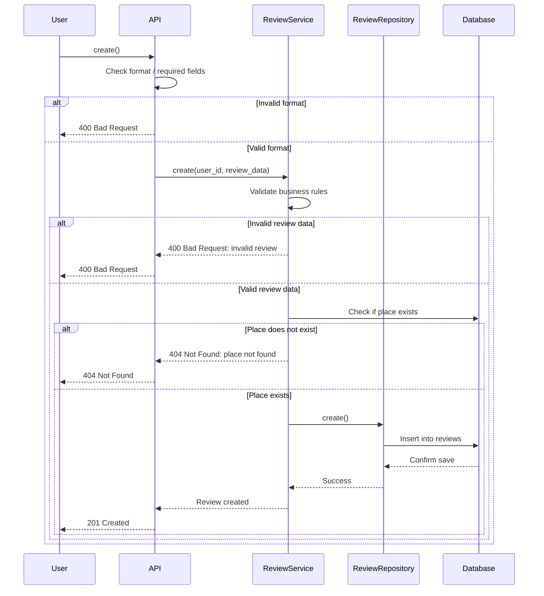
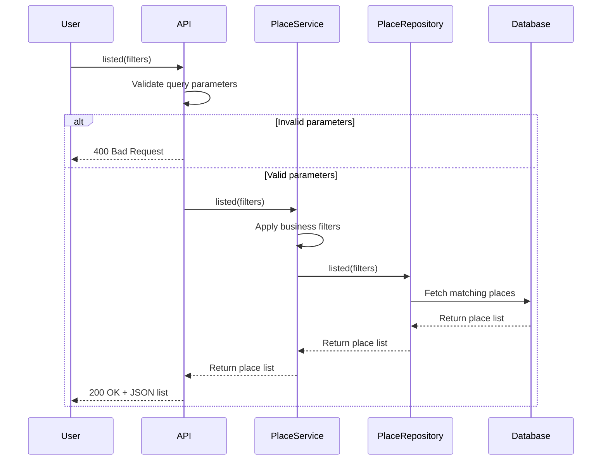

# 🏗️ HBnB – Documentation Technique de l’Architecture

---

## 📘 Introduction

Le projet **HBnB** est une ré-implémentation simplifiée de la plateforme AirBnB. Il comprend la gestion des comptes utilisateurs, la création d’annonces, la soumission d’avis, et la recherche avec filtres. Ce document présente la base technique de l’application, servant de référence tout au long du développement.

Il regroupe :
- Une vue d’architecture haut-niveau du système
- Un diagramme de classes pour la couche métier
- Quatre diagrammes de séquence pour illustrer les principales interactions API

---

## 🧱 Architecture Haut-Niveau

### 🔹 Vue d’ensemble

Le système HBnB est conçu en **architecture trois couches** :
- **Présentation (API)** : Gère les requêtes entrantes
- **Logique métier (Services)** : Applique les règles de l’application
- **Persistance (Repository)** : Gère les interactions avec la base de données

L’architecture applique le **modèle facade**, pour simplifier les appels entre API et logique métier.

### 🔸 Diagramme

- Les services `UserService`, `PlaceService`, `ReviewService` font office de facade.
- Les repositories isolent l’accès aux données.

### 🔸 Remarques

- Chaque couche est découplée, facilitant la maintenance.
- L’API ne communique **qu’avec les services**, jamais directement avec la base.

---

## 📐 Couche Logique Métier – Diagramme de Classes

### 🔹 Diagramme

### 🔸 Vue d’ensemble

Ce diagramme modélise les entités principales :
- `User` : méthode `register()`, propriétaire de `Place` et `Review`
- `Place` : possède une méthode `listed()`, est lié à `User` et `Amenity`
- `Review` : lié à un `User` et un `Place`, contient `rating`, `comment`
- `Amenity` : équipement associé à un `Place`
- `Base` : classe abstraite avec `create()`, `update()`, etc.

### 🔸 Relations

- `User 1 → * Place`
- `Place 1 → * Review`
- `Place * ↔ * Amenity`
- `Review * → 1 Place`
- `Review * → 1 User`

---

## 🔁 Diagrammes de Séquence – API

### 🧍 Enregistrement d’un utilisateur

- L'utilisateur s’enregistre via `API → UserService → UserRepository`
- Validation : format, règles métier, unicité de l'email
- Erreurs possibles : `400`, `409`
- Succès : `201 Created`

---

### 🏠 Création d’un lieu

- L'utilisateur crée un lieu avec `user_id` et `place_data`
- Le service applique les règles métier (ex : prix positif)
- Le lieu est enregistré via `PlaceRepository`
- Réponse : `201 Created` ou `400 Bad Request`

---

### 📝 Soumission d’un avis

- L'utilisateur envoie un avis sur un lieu existant
- Règles métier : commentaire, note valide, lieu existant
- Réponse : `201 Created`, ou erreur `400`, `404`

---

### 🏡 Récupération d’une liste de lieux

- L’utilisateur envoie une requête avec des filtres (ville, capacité…)
- Le service applique des filtres métier si besoin
- Le repository renvoie les lieux correspondants
- Réponse : `200 OK` avec la liste JSON

---

## ✅ Résumé

Ce document regroupe toute la base technique de HBnB : architecture, classes métiers, et interactions clés de l’API.
Il sert de référence claire, modulaire et maintenable pour guider le développement de l’application.

