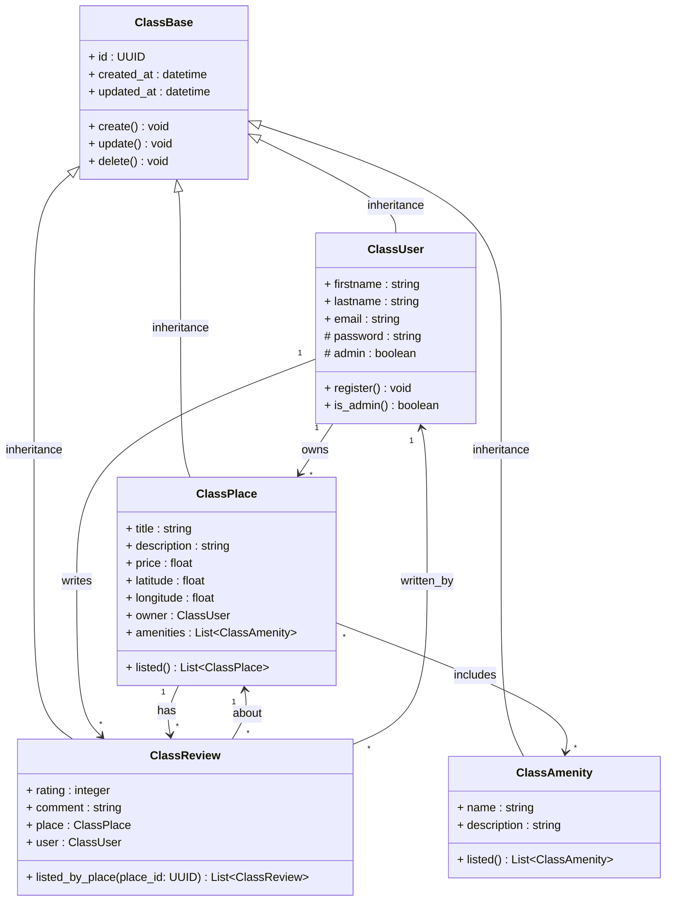

# 📐 Diagramme de classe détaillé pour la couche logique métier

## 🧭 Vue d’ensemble du fonctionnement

Ce diagramme de classes modélise la couche métier de l’application **HBnB**, en se concentrant sur les entités principales :
**User**, **Place**, **Review**, et **Amenity**.

L’objectif est de représenter leurs **attributs**, **méthodes** et **relations**, conformément aux règles métier.

---

## 🧱 Structure commune

Toutes les entités héritent de `ClassBase`, qui contient les attributs génériques communs à tous les objets métier :

- `id: UUID`
- `created_at: datetime`
- `updated_at: datetime`
- Méthodes de base : `create()`, `update()`, `delete()`

---

## 🧍 Entité : ClassUser

`ClassUser` représente un utilisateur de la plateforme HBnB. Il peut s'agir d'un utilisateur classique ou d'un administrateur, capable de créer des lieux et de publier des avis.

### Attributs :
- `firstname`, `lastname`, `email` : informations personnelles
- `password`, `admin` : informations d’authentification et de rôle

### Méthodes :
- `register()` : Permet à un utilisateur de s’enregistrer dans le système.
- `is_admin()` : Vérifie si un utilisateur a le rôle administrateur.

### Relations :
- Possède plusieurs `ClassPlace`
- Écrit plusieurs `ClassReview`

---

## 🏠 Entité : ClassPlace

`ClassPlace` représente un bien immobilier mis à disposition par un utilisateur. Chaque lieu est géolocalisé et peut être enrichi d’équipements.

### Attributs :
- `title`, `description`, `price`, `latitude`, `longitude`
- `owner: ClassUser`
- `amenities: List<ClassAmenity>`

### Méthodes :
- `listed()` : retourne tous les lieux

### Relations :
- Est possédé par un utilisateur
- Peut avoir plusieurs `Review`
- Est lié à plusieurs `Amenity`

---

## 📝 Entité : ClassReview

`ClassReview` représente un commentaire et une note laissés par un utilisateur après avoir visité un lieu.

### Attributs :
- `rating`, `comment`, `place`, `user`

### Méthodes :
- `listed_by_place(place_id)` : retourne toutes les reviews liées à un lieu

### Relations :
- Est écrit par un utilisateur
- Concerne un lieu

---

## 📺 Entité : ClassAmenity

`ClassAmenity` représente un équipement ou un service pouvant être associé à un lieu (ex: Wi-Fi, parking, piscine...).

### Attributs :
- `name`, `description`

### Méthodes :
- `listed()` : retourne tous les équipements

### Relations :
- Est utilisé par plusieurs lieux

---

## 🔗 Relations et Cardinalités
> Le tableau ci-dessous présente les principales associations entre entités, ainsi que les relations d'héritage avec la classe générique `ClassBase`.

| Relation            | Type        | Cardinalité |
|---------------------|-------------|-------------|
| User → Place        | Association | 1 → *       |
| User → Review       | Association | 1 → *       |
| Place → Review      | Association | 1 → *       |
| Place ↔ Amenity     | Association | * ↔ *       |
| Review → User       | Association | * → 1       |
| Review → Place      | Association | * → 1       |
| Base → Place        | Héritage    |             |
| Base → Review       | Héritage    |             |
| Base → Amenity      | Héritage    |             |
| Base → User         | Héritage    |             |
---

## 🧠 Choix de modélisation

- Les méthodes `listed()` sont placées dans chaque entité comme point d’entrée logique pour la récupération des données.
- Les relations sont modélisées avec des flèches UML (`-->`) accompagnées des cardinalités pour bien exprimer les dépendances.
- Les types sont explicités pour préparer la transition vers le code Python.

---
