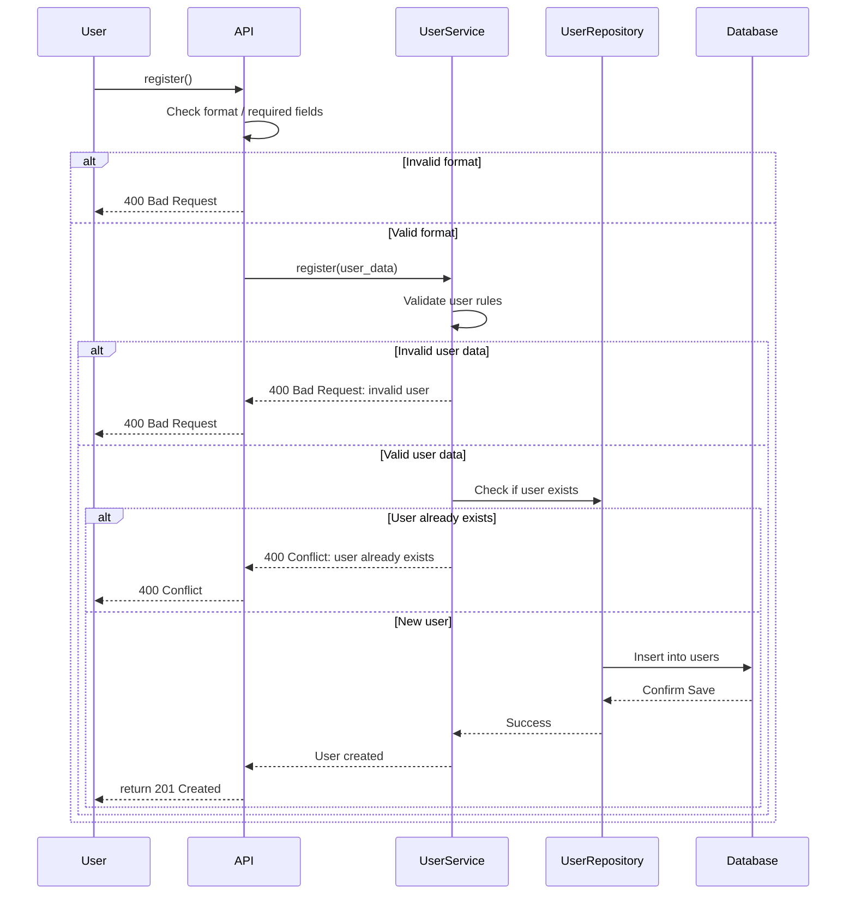
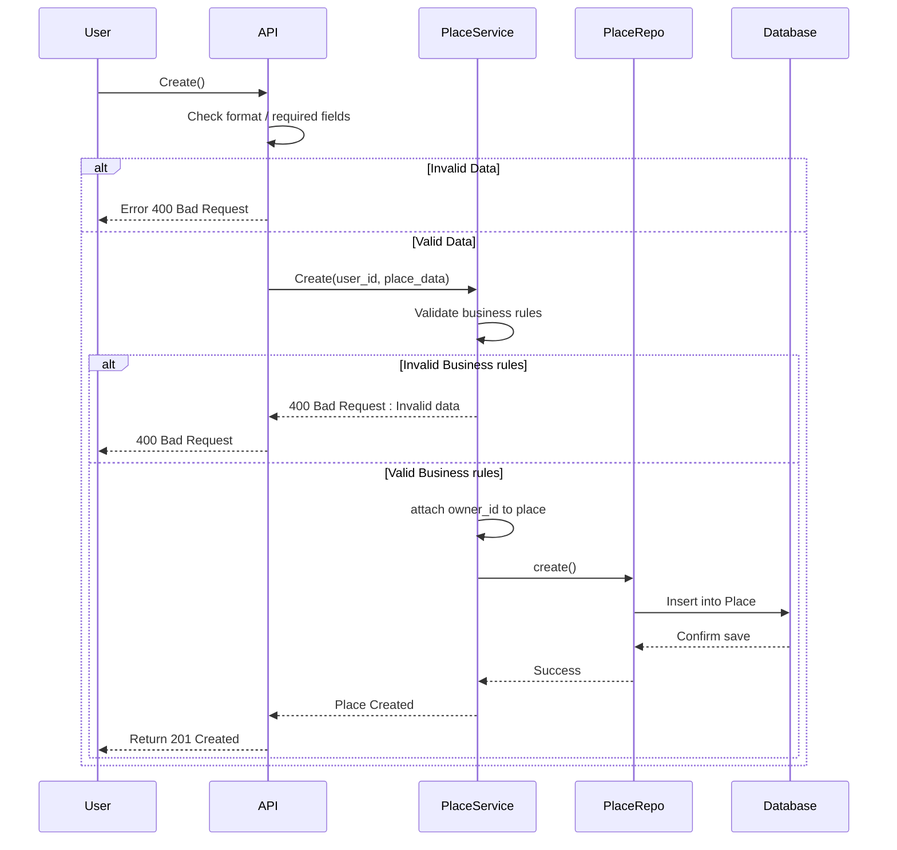
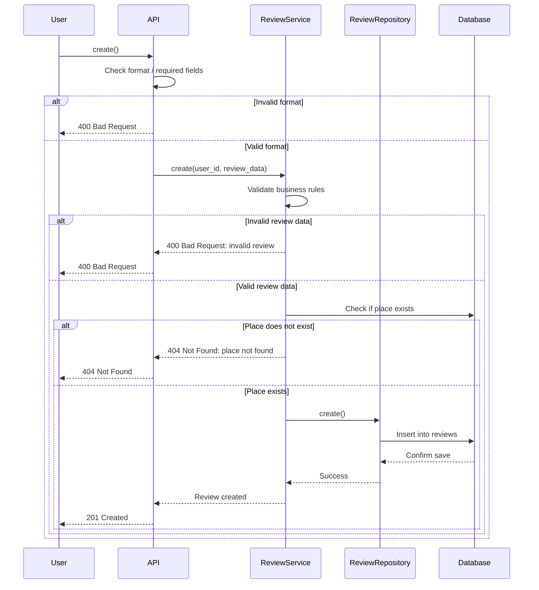
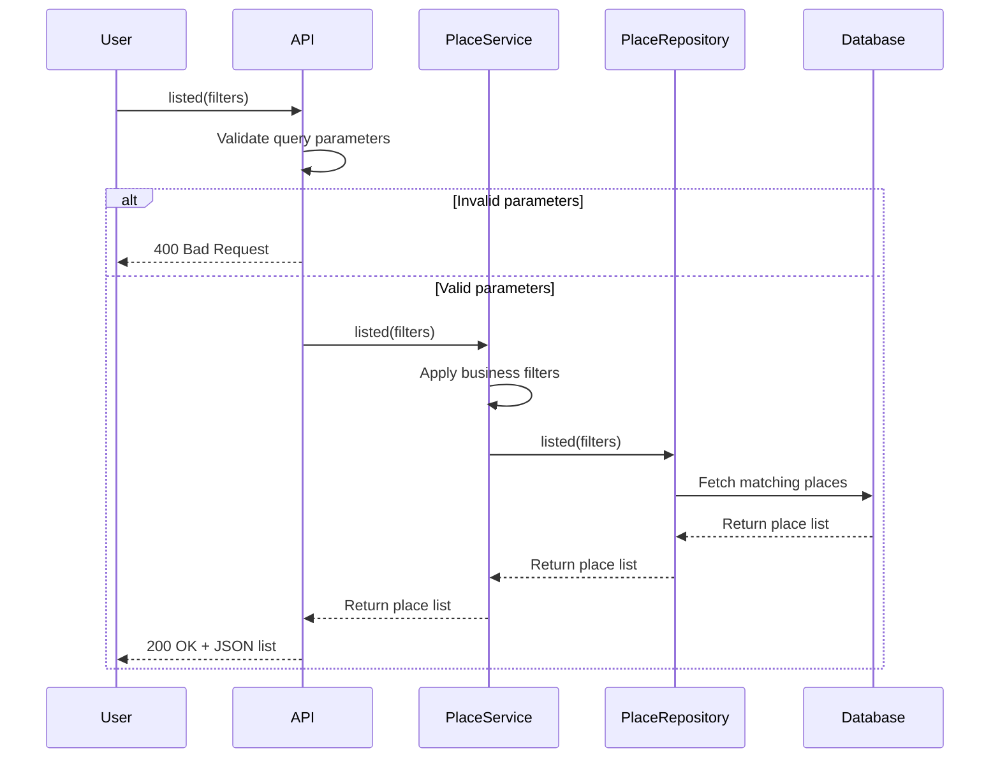

# 📲 Diagrammes de séquence pour les appels d'API
## 🧍 Diagramme de séquence pour l'enregistrement des utilisateurs

---

## 🧍 Inscription de l'utilisateur

### 🔹 Description :
L’utilisateur envoie une requête pour créer un compte sur la plateforme. Le système doit valider les données, vérifier l’unicité de l’adresse email, puis enregistrer l’utilisateur dans la base de données.

### 🔸 Flow des interactions :
- **API** : Vérifie la structure et les champs obligatoires (ex: email, mot de passe).
- **UserService** : Applique les règles métier (validité des données, unicité).
- **UserRepository** : Vérifie si l’utilisateur existe déjà, puis enregistre le nouvel utilisateur.
- **Database** : Enregistre les données persistantes.
- En cas de succès, l’API renvoie un `201 Created`. Sinon, des erreurs `400` ou `409` sont retournées selon le cas.

---
## 🏠 Diagramme de séquence pour la création de lieux

---

## 🏠 Création de lieux

### 🔹 Description :
Un utilisateur authentifié crée une nouvelle annonce de logement. Le système valide les données du logement, les complète avec l’`owner_id`, puis les enregistre en base.

### 🔸 Flow des interactions :
- **API** : Vérifie le format et les champs requis dans la requête.
- **PlaceService** : Applique les règles métier (ex: prix positif, description présente).
- **PlaceService** ajoute l'identifiant de l’utilisateur comme propriétaire du `Place`.
- **PlaceRepository** : Enregistre l’objet dans la base.
- **Database** : Confirme l’enregistrement.
- Le système retourne un `201 Created` ou une erreur `400` en cas de problème.

---
## 📝 Diagramme de séquence pour la soumission dun avis

---

## 📝 Soumission d'un avis

### 🔹 Description :
Un utilisateur souhaite publier un avis (note/commentaire) sur un logement. Le système valide l’avis, s’assure que le logement existe, puis le sauvegarde.

### 🔸 Flow des interactions :
- **API** : Vérifie la structure des données (`rating`, `comment`, `place_id`…).
- **ReviewService** : Applique les règles métier (note dans les bornes, commentaire non vide).
- Le service vérifie ensuite que le `Place` ciblé existe dans la base.
- **ReviewRepository** : Insère la `Review`.
- **Database** : Confirme l’enregistrement.
- Réponse : `201 Created` si succès, sinon `400` ou `404` selon l’erreur.

---
## 🏡 Diagramme de séquence pour récupérer une liste de lieux

---

## 🏡 Récupération d'une liste de lieux

### 🔹 Description :
L’utilisateur envoie une requête pour consulter une liste de logements disponibles, en filtrant éventuellement par ville, capacité, etc.

### 🔸 Flow des interactions :
- **API** : Valide les paramètres de requête (types, valeurs).
- **PlaceService** : Applique des règles supplémentaires (filtres métier ou valeurs par défaut).
- **PlaceRepository** : Exécute la requête filtrée vers la base.
- **Database** : Retourne la liste des `Place` correspondants.
- La liste est remontée jusqu’à l’utilisateur avec un `200 OK` + `fichier json`.

---
