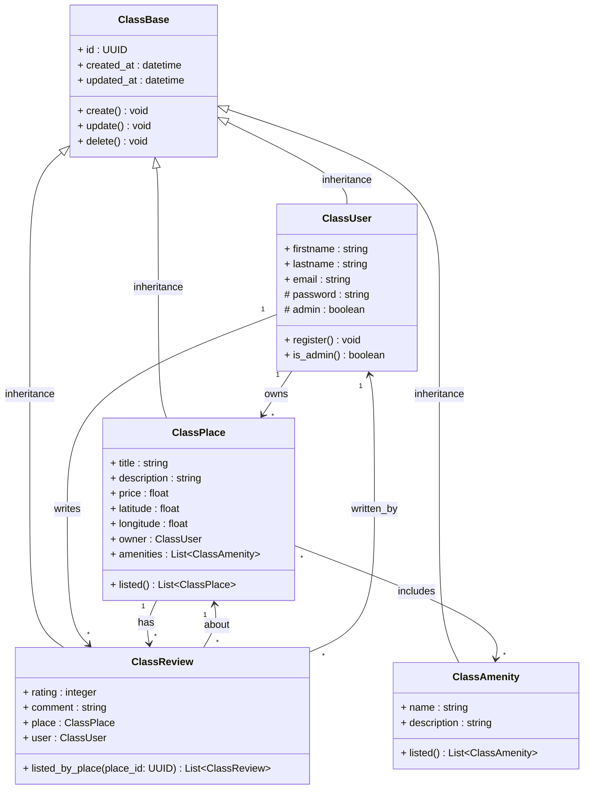

```mermaid
classDiagram
class ClassUser {
    + firstname : string
    + lastname : string
    + email : string
    # password : string
    # admin : boolean
    + register() void
    + is_admin() boolean
}
class ClassReview {
    + rating : integer
    + comment : string
    + place : ClassPlace
    + user : ClassUser
    + listed_by_place(place_id: UUID) List~ClassReview~
}
class ClassBase{
    + id : UUID
    + created_at : datetime
    + updated_at : datetime
    + create() void
    + update() void
    + delete() void
}
class ClassPlace {
    + title : string
    + description : string
    + price : float
    + latitude : float
    + longitude : float
    + owner : ClassUser
    + amenities : List~ClassAmenity~
    + listed() List~ClassPlace~
}
class ClassAmenity {
    + name : string
    + description : string
    + listed() List~ClassAmenity~
}
ClassBase <|-- ClassUser : inheritance
ClassBase <|-- ClassPlace : inheritance
ClassBase <|-- ClassReview : inheritance
ClassBase <|-- ClassAmenity : inheritance
ClassUser "1" --> "*" ClassPlace : owns
ClassUser "1" --> "*" ClassReview :writes
ClassPlace "1" --> "*" ClassReview : has
ClassPlace "*" --> "*" ClassAmenity : includes
ClassReview "*" --> "1" ClassPlace : about
ClassReview "*" --> "1" ClassUser : written_by
```
