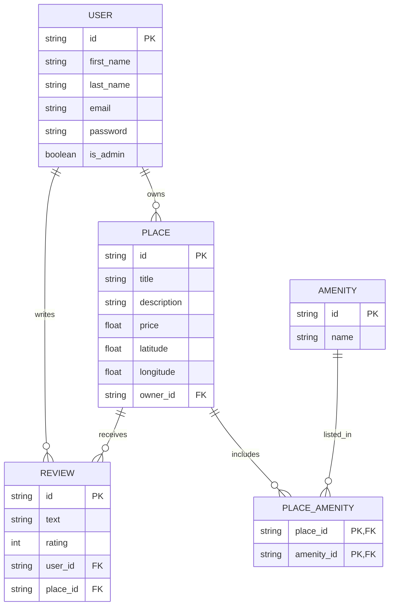
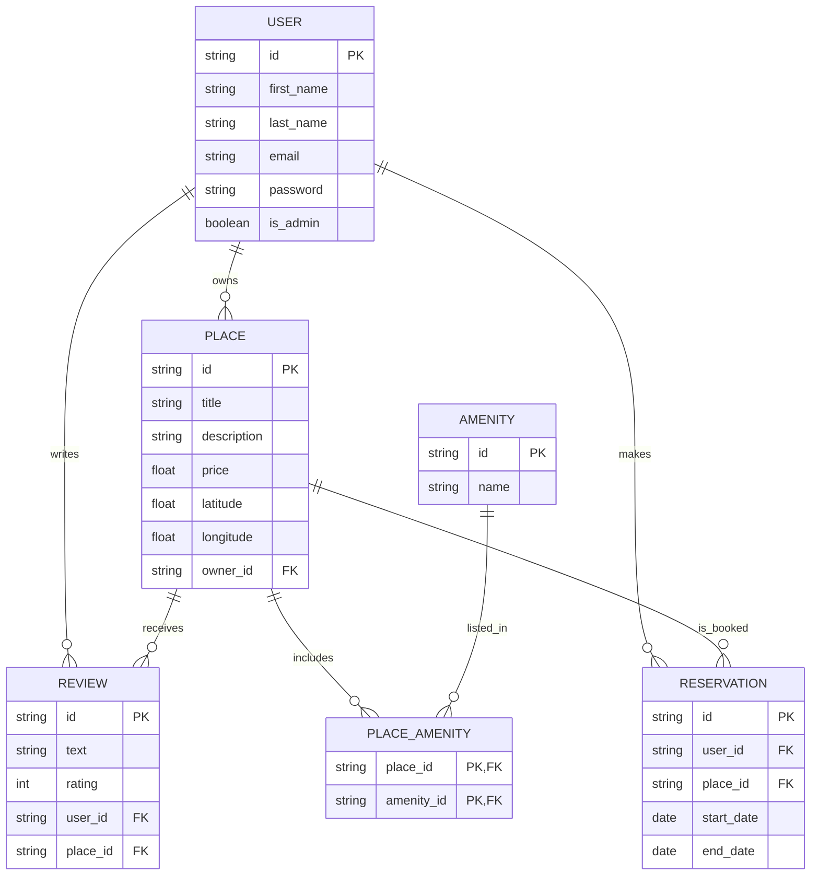

# HBnB - Part 3: Authentication & Database Integration


[](https://mermaid.js.org)
[](http://127.0.0.1:5000/)

This repository contains Part 3 of the HBnB project. In this phase, we secure the backend with **authentication**, implement **role-based access control**, and transition from in-memory storage to a **persistent relational database** using **SQLite** and **SQLAlchemy** (with **MySQL** support for production).

## 📚 Project Scope

This phase of the HBnB project brings to life the application's internal functionality by implementing:

- 🔐 **User Authentication** via **JWT** (`flask-jwt-extended`)
- 🛂 **Authorization** based on user roles (`is_admin`)
- 💾 **Database Integration** using **SQLAlchemy** with **SQLite**
- 🗃️ **Persistent CRUD Operations**
- 🧠 **Relational Schema Visualization** using **Mermaid.js**
- ✅ **Data Validation** and consistency at the model level

---

## 🏗️ Project Structure

```
hbnb/
├── app/                           # Core application logic
│   ├── __init__.py                # Initializes the app package
│   ├── extensions.py              # # Global instances of SQLAlchemy (db) and Bcrypt (password security)
│   ├── validators.py              # Input validation logic
│
│   ├── api/                       # 🌐 Presentation Layer (Flask-RESTx APIs) secured via JWT.
│   │   └── v1/                    # Version 1 of the API
│   │       ├── admins.py          # # Admin-only routes: create/update users, amenities, places, reviews
│   │       ├── auth.py            # Authentication routes: login, protected test route (JWT-based)
│   │       ├── users.py           # CRUD for users
│   │       ├── places.py          # CRUD for places
│   │       ├── reviews.py         # CRUD for reviews
│   │       ├── amenities.py       # CRUD for amenities
│
│   ├── models/                    # 🧠 Business Logic Layer
│   │   ├── base_model.py          # Shared base class (id, created_at, updated_at, save, update)
│   │   ├── user.py                # User entity
│   │   ├── place.py               # Place entity (linked to User, Amenity, Review)
│   │   ├── review.py              # Review entity (linked to User and Place)
│   │   ├── amenity.py             # Amenity entity (linked to Place)
│
│   ├── persistence/               # 💾 In-Memory Persistence Layer
│   │   ├── repository.py          # Abstract and in-memory repository implementations
│
│   ├── services/                  # 🪄 Facade Layer
│   │   ├── repositories/
│   │       ├── user_repository.py # Repository class for User model with method to find by email
│   │   ├── facade.py              # HBnBFacade: interface to all business operations
│
├──sql/
│   ├──amenities.sql               # SQL schema for Amenities table
│   ├──initial_data.sql            # SQL schema for initial_data
│   ├──place_amenities.sql         # SQL schema for place_amenities table
│   ├──places.sql                  # SQL schema for Places table
│   ├──reviews.sql                 # SQL schema for Reviews table
│   ├──users.sql                   # SQL schema for Users table
│
├── tests/                         # ✅ Unit tests for models and APIs
│   ├── test_user.py               # Tests for User logic and endpoints
│   ├── test_place.py              # Tests for Place logic and endpoints
│   ├── test_review.py             # Tests for Review logic and endpoints
│   ├── test_amenity.py            # Tests for Amenity logic and endpoints
│   └── TEST_REPORT.md             # Manual test results or coverage report
│
├── config.py                      # Application settings and configuration
├── development.db                 # Database
├── README.md                      # Project documentation (you're here!)
├── requirements.txt               # Python dependencies (Flask, flask-restx, etc.)
├── reset_db.py                    # # Script to drop and recreate all database tables (dev use only)
└── run.py                         # Entrypoint for running the Flask app

```
---
### 📊 Entity-Relationship (ER) Diagram


---
### 📊 Entity-Relationship (ER) Diagram with reservation

---

## 🔌 How to Run

### 1. Clone the repository

```bash
git clone https://github.com/GuarickGit/holbertonschool-hbnb.git
cd holbertonschool-hbnb
```

### 2. Install dependencies

```bash
pip install -r requirements.txt
```

### 3. Run the application

```bash
python run.py
```

Access Swagger documentation at:

```
http://127.0.0.1:5000/
```

---

## 🔧 Features Implemented

### ✅ Authentication
- JWT login with access/refresh tokens (flask-jwt-extended)
- Password hashing via bcrypt
- Login endpoint returns token for protected routes

✅ Authorization
- Regular users can manage their own content
- Admins can manage any resource and create users

✅ Database Integration
- Persistent storage via SQLite (dev)
- Compatibility with MySQL (prod)
- Entity mapping via SQLAlchemy ORM

## ✅ Secure API Endpoints

### 🔹 Users
| Method | Endpoint                         | Description                              | Access          |
|--------|----------------------------------|------------------------------------------|-----------------|
| `POST` | `/api/v1/users/`                 | Create a new user                        |Admin only       |
| `GET`  | `/api/v1/users/`                 | Retrieve all users                       |Admin only       |
| `GET`  | `/api/v1/users/<user_id>`        | Retrieve a specific user by ID           |Admin or Owner   |
| `PUT`  | `/api/v1/users/<user_id>`        | Update a user’s information              |Admin only       |

---

### 🔹 Places, Reviews, Amenities
- Only logged-in users can:
   - Create, update, or delete their own places/reviews
- Admins can manage all

---

## ✅ Validation and Testing

- All fields validated at model level (e.g. price > 0, email format, lat/lon ranges).
- Status codes respected: `201 Created`, `200 OK`, `400 Bad Request`, `404 Not Found`.
- Tested using `curl`, Swagger UI.

---

## 🧪 Example `curl` Commands

```bash
# Create a user
curl -X POST http://localhost:5000/api/v1/users/ \
  -H "Content-Type: application/json" \
  -d '{"first_name": "Axel", "last_name": "Goré", "email": "axel.goré@gmail.com"}'

# Get all places
curl http://localhost:5000/api/v1/places/
```
### 🧪 Admin-only User Creation with JWT
To create new users, a valid JWT token from an authenticated admin user is required.
This enforces role-based access control at the API level.
✅ Required Header
```
Authorization: Bearer <admin_access_token>
```
### 📥 Example Request (with token)
```curl
curl -X POST http://localhost:5000/api/v1/users/ \
  -H "Content-Type: application/json" \
  -H "Authorization: Bearer <your_admin_token>" \
  -d '{
    "first_name": "Samira",
    "last_name": "Roche",
    "email": "samira@example.com",
    "password": "MyStrongPass123"
  }'
  ```
### 🔁 Response
```json
{
  "id": "user-uuid",
  "first_name": "Samira",
  "last_name": "Roche",
  "email": "samira@example.com",
  "is_admin": false
}
```
---

## 🧪 Example Swagger UI Test

You can test endpoints directly from the **Swagger UI** (interactive docs) available at:

http://localhost:5000/

### 🔹 Example: `POST /api/v1/users/`

#### 📤 Request Body (via Swagger "Try it out")

```json
{
  "first_name": "Axel",
  "last_name": "Goré",
  "email": "axel.goré@gmail.com"
}
```

#### 📥 Example Response (201 Created)
```json
{
  "id": "8f1c6a97-b6c0-47c0-8bc3-507e5e2e55e3",
  "first_name": "Axel",
  "last_name": "Goré",
  "email": "axel.goré@gmail.com",
}
```

#### 🧾 Response Headers
```
connection: close
content-length: 150
content-type: application/json
date: Sun, 22 Jun 2025 17:47:27 GMT
server: Werkzeug/3.1.3 Python/3.12.3
```
#### ✅ Possible Status Codes
```json
201 - User successfully created
400 - Bad request: Email already registered, missing field, or invalid format
```

## 📘 Swagger API Documentation

Visit:

```
http://localhost:5000/
```

This interactive documentation is automatically generated from the codebase using `flask-restx`.

---

## 🧠 Key Learnings

- How to use Flask-JWT-Extended for secure API sessions
- Role-based authorization with admin privileges
- Modeling complex entity relationships using SQLAlchemy
- Writing reusable repositories with database access
- Visualizing schema design using Mermaid.js diagrams

---

## 🧰 Technologies Used

| Category         | Tools / Frameworks                               |
|------------------|--------------------------------------------------|
| Language         | Python 3.12.3                                    |
| Web Framework    | Flask + + Flask-JWT-Extended                     |
| API Docs         | Swagger UI (auto-generated via `flask-restx`)    |
| ORM              | SQLAlchemy                                       |
| DB (dev)         | SQLite                                           |
| DB (prod)        | MySQLAlchemy                                     |
| Auth             | JWT token                                        |
| Security         | Bcrypt (password hashing)                        |
| Architecture     | Layered MVC + Facade Pattern                     |
| Validation       | Custom validation logic (`validators.py`)        |
| Persistence      | In-memory Repository (dictionary-based)          |
| Testing          | `curl`, `swagger`                                |
| Documentation    | Markdown (`README.md`), Swagger, curl examples   |

---

## 📚 Resources

- [Flask Documentation](https://flask.palletsprojects.com/)
- [Flask-RESTx Docs](https://flask-restx.readthedocs.io/)
- [Flask-JWT-Extended](https://flask-jwt-extended.readthedocs.io/en/stable/)
- [SQLAlchemy ORM](https://docs.sqlalchemy.org/en/20/)
- [Swagger UI](https://swagger.io/tools/swagger-ui/)
- [REST API Design Guide](https://restfulapi.net/)
- [PEP8 Style Guide](https://peps.python.org/pep-0008/)

## 👥 Authors

- **Fresne Kévin** – [@GuarickGit](https://github.com/GuarickGit)
- **Roche Samira** – [@StrawberSam](https://github.com/StrawberSam)
